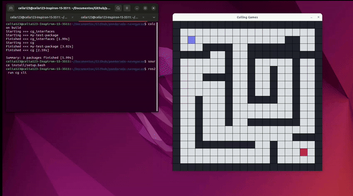
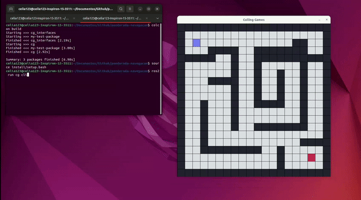

# Ponderada Maze
Navegação com ROS: implementar dois métodos distintos de navegação; a navegação reativa e a navegação com mapa.

## Descrição e Funcionalidades
1. **Navegação Reativa (`navegacao_reativa.py`)**
- O robô utiliza informações dos sensores sobre os quadrados adjacentes nas direções 'left', 'down', 'up', and 'right'.
- **Lógica Utilizada**
    - Exploração Baseada em Sensores: o robô verifica os quadrados adjacentes e decide para onde mover com base nos espaços livres disponíveis. 
    - Posições Visitadas: armazena as posições já visitadas para evitar loops.
    - Prioridade de Movimento: 
        - Direção ao Alvo: calcula a distância manhattan para o alvo e escolhe a mais curta.
        - Contorno de Obstáculos: se não puder se aproximar diretamente do alvo, o robô segue as paredes procurando um caminho livre. 
    - Backtracking: utiliza uma pilha para armazenas a posição anterior quando não há movimentos válidos disponíveis. 
- **Objetivo**
    - Navegar até o alvo (quadrado vermelho) utilizando apenas informações locais e estratégias de exploração.

2. **Navegação Mapaeda (`navagacao_mapeada.py`)**
- Solicita o mapa completo do labirinto através do serviço `/get_map`.
- **Lógica Utilizada**
    - Converte o mapa recebido em uma matriz numérica, onde células livres são representadas por 0 e com obstáculos por 1.
    - Algoritmo A*: combina Heurística de Manhattan, explora os vizinhos para identificar obstáculos, conjunto aberto de posições e serem exploradas e conjunto fechado das já visitidas, e por fim, reconstrói o caminho.
- **Execução do Caminho**
    - O robô segue o caminho planejado, enviando comandos de movimento nas direções do algoritmo A*.
    - Após cada movimento, verifica se o comando foi executado com sucesso antes de prosseguir para o próximo passo.
- **Objetivo**
    - Alcançar o alvo utilizando conhecimento do ambiente e planejamento de rota.

## Configuração e Execução
### Pré-requisitos
- ROS2
- Python 3
- Bibliotecas Python: `rclpy` e `numpy`
- Colcon (ferramenta para compilar pacotes ROS2)

### Passo a Passo para Execução
1. **Clonar repositório**

```bash
git clone https://github.com/josevalencar/ros2-maze.git
```

2. **Executar o 'Maze'**

```bash
colcon build
```
```bash
source install/setup.bash
```
```bash
ros2 run cg maze
```

3. **Rodar Navegações**
- Abra outro terminal 
```bash
colcon build
```
```bash
source install/setup.bash
```
```bash
ros2 run cg cli
```
- Escolha 'Navegação Reativa' ou 'Navegação Mapeada'

### Vídeo do Funcionamento
#### Navegação Reativa

#### Navegação Mapeada

